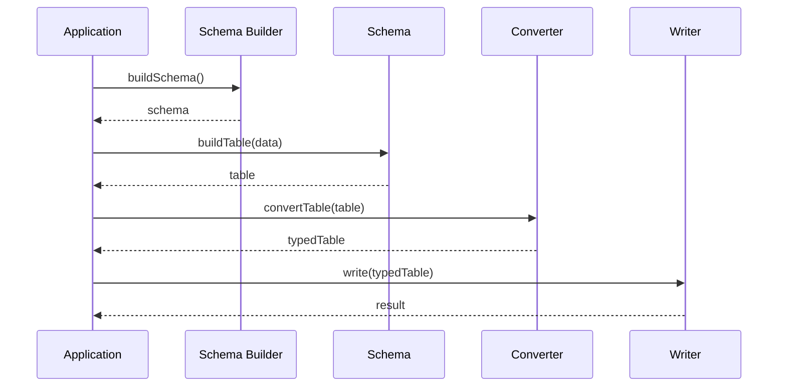
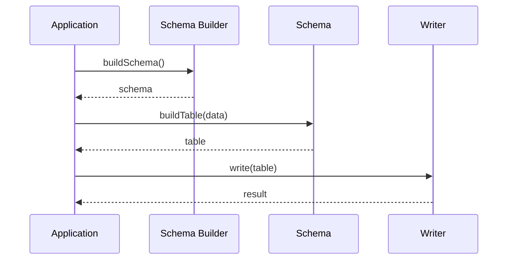

# Building Reports

## Report Flow

Full cycle looks like this:



Converting generic report table to typed table is optional. It's possible to work with it. Examples given here do not use conversion.

Here is the diagram without converting report:



## Building Report Schema

Report schema is object containing information what columns/rows report has, what properties they have, what additional actions are to be taken. It's quite complex object, so it's more convenient to use schema builders - classes providing handy way to build report schema.

There are 2 types of reports: vertical and horizontal. Vertical report is report having fixed number of columns and dynamic number of rows. Horizontal report, on the other hand, has fixed number of rows and dynamic number of columns.

XReports.Core provides ReportSchemaBuilder class to build schema. It is a generic class with type argument that specifies type of data source item.

## Vertical Report

Vertical report consists of columns. Each column has to have:
- ID (optional) - column ID, can be used to unambiguously refer to column
- title (required) - title of the column, will be displayed in header cell  
cannot be null, but can be empty string
can be used to refer to column
- report cells provider (required) - the class responsible for providing report cells  
more on this later

### Simple Example

Let's dive into building report by looking at code.

[Working example](../../docs-samples/building-reports/XReports.DocsSamples.BuildingReports.VerticalSimple/Program.cs)

```c#
// Model describing report data source item.
class Customer
{
    public string Name { get; set; }
    public string Email { get; set; }
    public int Age { get; set; }
}

// You can use dynamic if you don't know type of data.
ReportSchemaBuilder<Customer> builder = new ReportSchemaBuilder<Customer>();

// Specify columns.
builder.AddColumn("Name", (Customer x) => x.Name);
builder.AddColumn("Email", (Customer x) => x.Email);
builder.AddColumn("Age", (Customer x) => x.Age);

// Build schema.
IReportSchema<Customer> schema = builder.BuildVerticalSchema();

// Data source is IEnumerable which allows iterating over large
// collection without having to load it into memory.
IEnumerable<Customer> dataSource = new Customer[]
{
    new Customer { Name = "John Doe", Email = "john@example.com", Age = 23, },
    new Customer { Name = "Jane Doe", Email = "jane@example.com", Age = 22, },
};

// Report table contains header and body of the report.
IReportTable<ReportCell> reportTable = schema.BuildReportTable(dataSource);

// SimpleConsoleWriter is an example class that writes report table data into console.
new SimpleConsoleWriter().Write(reportTable);

/*
|                 Name |                Email |                  Age |
----------------------------------------------------------------------
|             John Doe |     john@example.com |                   23 |
|             Jane Doe |     jane@example.com |                   22 |
*/
```

You can add columns using following methods:

```c#
// Add column to the end.
builder.AddColumn("Name", (Customer x) => x.Name);

// Insert column at specified position (0-based).
builder.InsertColumn(0, "Name", (Customer x) => x.Name);

// Insert column before another column.
// Here column Name will be added before column with title "Age".
builder.InsertColumnBefore("Age", "Name", (Customer x) => x.Name);

// Any of the methods above can be used with column ID specified
// right before title.
// ID does not have to be the same as column title, but it has to be
// unique among all column IDs.
builder.InsertColumn(0, new ColumnId("Name"), "Name", (Customer x) => x.Name);

// Also it is possible to use column ID for inserting column
// before another one.
builder.InsertColumnBefore(new ColumnId("Age"), "Name", (Customer x) => x.Name);
```

Writer class used in this example iterates over header and body row by row and writes cells into console. You can check the code [here](../../docs-samples/XReports.DocsSamples.Common/SimpleConsoleWriter.cs).

### IDataReader

Special case of data source is System.Data.IDataReader. In this case columns callbacks will get IDataReader as argument.

[Working example](../../docs-samples/building-reports/XReports.DocsSamples.BuildingReports.VerticalFromDataReader/Program.cs)

```c#

await using SqliteConnection connection = new SqliteConnection("Data Source=:memory:");

await connection.OpenAsync();

// Setup database
await using SqliteCommand command = connection.CreateCommand();
command.CommandText = "CREATE TABLE Customers(Name text, Email text, Age integer)";
await command.ExecuteNonQueryAsync();
command.CommandText =
    @"INSERT INTO Customers(Name, Email, Age) VALUES
        ('John Doe', 'john@example.com', 23),
        ('Jane Doe', 'jane@example.com', 22)";
await command.ExecuteNonQueryAsync();

// Type of data source is IDataReader.
ReportSchemaBuilder<IDataReader> builder = new ReportSchemaBuilder<IDataReader>();

// Callbacks accept IDataReader.
builder.AddColumn("Name", (IDataReader x) => x.GetString(0));
builder.AddColumn("Email", (IDataReader x) => x.GetString(1));
builder.AddColumn("Age", (IDataReader x) => x.GetInt32(2));

// Build schema.
IReportSchema<IDataReader> schema = builder.BuildVerticalSchema();

// Get IDataReader.
command.CommandText = "SELECT Name, Email, Age FROM Customers";
IDataReader dataReader = await command.ExecuteReaderAsync(CommandBehavior.CloseConnection);

// AsEnumerable is an extension method that allows iterating over IDataReader.
IReportTable<ReportCell> reportTable = schema.BuildReportTable(dataReader.AsEnumerable());

new SimpleConsoleWriter().Write(reportTable);

/*
|                 Name |                Email |                  Age |
----------------------------------------------------------------------
|             John Doe |     john@example.com |                   23 |
|             Jane Doe |     jane@example.com |                   22 |
*/
```

### Complex Header

Sometimes report should have columns headers grouped. For example, report should group columns related to customer personal information.

[Working example](../../docs-samples/building-reports/XReports.DocsSamples.BuildingReports.VerticalComplexHeader/Program.cs)

```c#
class Customer
{
    public string Name { get; set; }
    public string Email { get; set; }
    public int Age { get; set; }
	public string JobTitle { get; set; }
	public decimal Salary { get; set; }
}

ReportSchemaBuilder<Customer> builder = new ReportSchemaBuilder<Customer>();
builder.AddColumn("Name", (Customer x) => x.Name);
builder.AddColumn("Email", (Customer x) => x.Email);
builder.AddColumn("Age", (Customer x) => x.Age);
builder.AddColumn(new ColumnId("Job"), "Job", (Customer x) => x.JobTitle);
builder.AddColumn(new ColumnId("Salary"), "Salary ($)", (Customer x) => x.Salary);

// Complex header rows have 0-based index indicating order of the row (0 - top).
// Add complex header by column indexes (0-based): from-to.
builder.AddComplexHeader(0, "Customer Information", 0, 4);
// Or by column titles.
// Code below combines columns from Name to Age under Personal Information.
builder.AddComplexHeader(1, "Personal Information", "Name", "Age");
// Also you can use column ID.
builder.AddComplexHeader(1, "Job Info", new ColumnId("Job"), new ColumnId("Salary"));

// Build schema.
IReportSchema<Customer> schema = builder.BuildVerticalSchema();

IEnumerable<Customer> dataSource = new Customer[]
{
    new Customer { Name = "John Doe", Email = "john@example.com", Age = 23, JobTitle = "Manager", Salary = 1500m },
    new Customer { Name = "David Doe", Email = "david@example.com", Age = 22, JobTitle = "Director", Salary = 2000m },
};

IReportTable<ReportCell> reportTable = schema.BuildReportTable(dataSource);

new ConsoleWriter().Write(reportTable);

/*
|                                                                                             Customer Information |
|----------------------|----------------------|----------------------|----------------------|----------------------|
|                                               Personal Information |                                    Job Info |
|----------------------|----------------------|----------------------|----------------------|----------------------|
|                 Name |                Email |                  Age |                  Job |           Salary ($) |
|----------------------|----------------------|----------------------|----------------------|----------------------|
|             John Doe |     john@example.com |                   23 |              Manager |                 1500 |
|            David Doe |    david@example.com |                   22 |             Director |                 2000 |
*/
```

## Horizontal Report

### Simple Example

[Working example](../../docs-samples/building-reports/XReports.DocsSamples.BuildingReports.HorizontalSimple/Program.cs)

```c#
// Model describing report data source item.
class Customer
{
    public string Name { get; set; }
    public string Email { get; set; }
    public int Age { get; set; }
}


ReportSchemaBuilder<Customer> builder = new ReportSchemaBuilder<Customer>();

// Specify columns. They will become rows during building schema.
builder.AddColumn("Name", (Customer x) => x.Name);
builder.AddColumn("Email", (Customer x) => x.Email);
builder.AddColumn("Age", (Customer x) => x.Age);

// Build schema.
IReportSchema<Customer> schema = builder.BuildHorizontalSchema(0);

IEnumerable<Customer> dataSource = new Customer[]
{
    new Customer { Name = "John Doe", Email = "john@example.com", Age = 23 },
    new Customer { Name = "Jane Doe", Email = "jane@example.com", Age = 22 },
};

IReportTable<ReportCell> reportTable = schema.BuildReportTable(dataSource);

new SimpleConsoleWriter().Write(reportTable);

/*
|                 Name |             John Doe |             Jane Doe |
|                Email |     john@example.com |     jane@example.com |
|                  Age |                   23 |                   22 |
*/
```

### Header Row

Often header is required in horizontal report. Here is how to do this.

[Working example](../../docs-samples/building-reports/XReports.DocsSamples.BuildingReports.HorizontalHeaderRow/Program.cs)

```c#
class Customer
{
    public string Name { get; set; }
    public string Email { get; set; }
    public int Age { get; set; }
}

ReportSchemaBuilder<Customer> builder = new ReportSchemaBuilder<Customer>();

// Specify columns. They will become rows during building schema.
builder.AddColumn(string.Empty, (Customer x) => x.Name.ToUpperInvariant());
builder.AddColumn("Email", (Customer x) => x.Email);
builder.AddColumn("Age", (Customer x) => x.Age);

// Build horizontal schema. The first column should become header row.
IReportSchema<Customer> schema = builder.BuildHorizontalSchema(1);

IEnumerable<Customer> dataSource = new Customer[]
{
    new Customer { Name = "John Doe", Email = "john@example.com", Age = 23 },
    new Customer { Name = "Jane Doe", Email = "jane@example.com", Age = 22 },
};

IReportTable<ReportCell> reportTable = schema.BuildReportTable(dataSource);

new SimpleConsoleWriter().Write(reportTable);

/*
|                      |             JOHN DOE |             JANE DOE |
----------------------------------------------------------------------
|                Email |     john@example.com |     jane@example.com |
|                  Age |                   23 |                   22 |
*/
```

### Complex Header

[Working example](../../docs-samples/building-reports/XReports.DocsSamples.BuildingReports.HorizontalComplexHeader/Program.cs)

```c#
class Customer
{
    public string Name { get; set; }
    public string Phone { get; set; }
    public string Email { get; set; }
    public int Age { get; set; }
}

ReportSchemaBuilder<Customer> builder = new ReportSchemaBuilder<Customer>();

// Specify columns. They will become rows during building schema.
builder.AddColumn("Name", (Customer x) => x.Name);
builder.AddColumn("Phone", (Customer x) => x.Phone);
builder.AddColumn("Email", (Customer x) => x.Email);
builder.AddColumn("Age", (Customer x) => x.Age);

// Add complex header. For horizontal report header cells are at left.
builder.AddComplexHeader(0, "Contact Info", "Phone", "Email");

// Build schema.
IReportSchema<Customer> schema = builder.BuildHorizontalSchema(0);

IEnumerable<Customer> dataSource = new Customer[]
{
    new Customer { Name = "John Doe", Email = "john@example.com", Age = 23, Phone = "1111111111" },
    new Customer { Name = "Jane Doe", Email = "jane@example.com", Age = 22, Phone = "2222222222" },
};

IReportTable<ReportCell> reportTable = schema.BuildReportTable(dataSource);

new ConsoleWriter().Write(reportTable);

/*
|                                        Name |             John Doe |             Jane Doe |
|         Contact Info |                Phone |           1111111111 |           2222222222 |
|                      |                Email |     john@example.com |     jane@example.com |
|                                         Age |                   23 |                   22 |
*/
```
